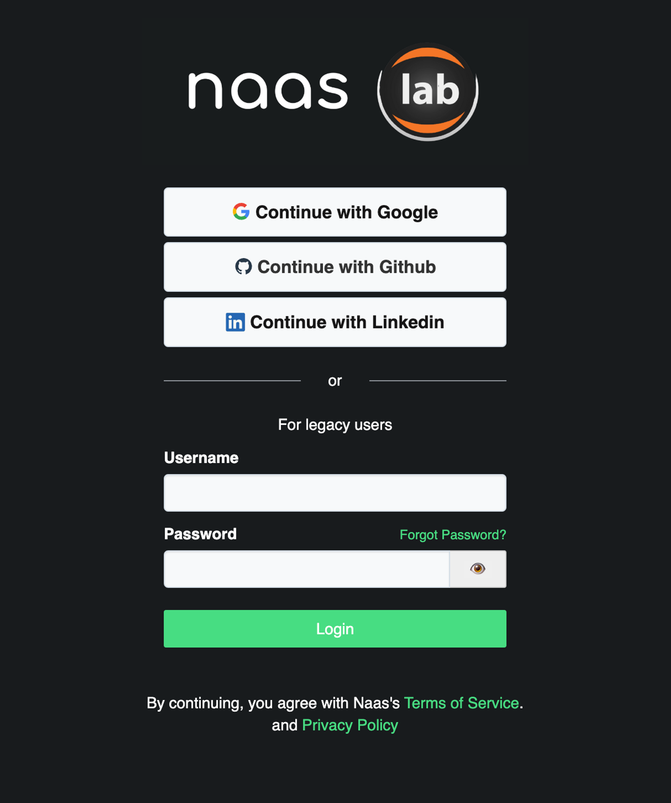
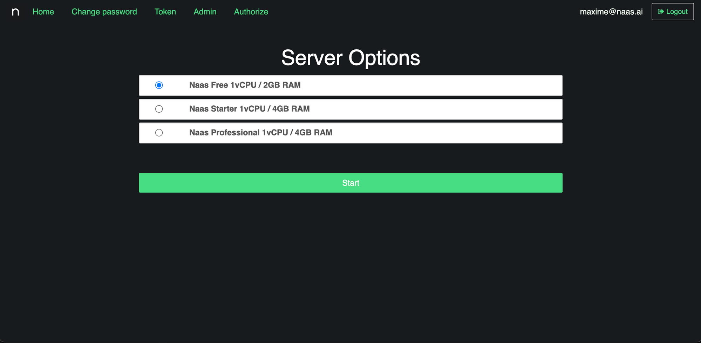
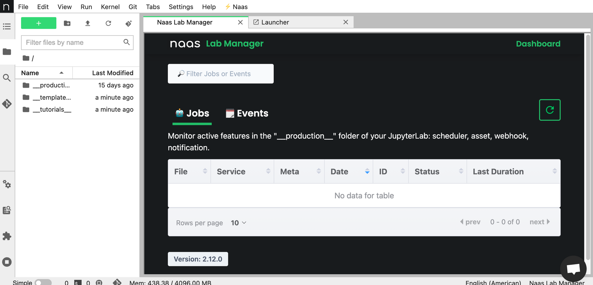

# Quick start

Welcome to the Naas documentation for developers. This quick start is here to help you get right in the core of the product. This page won't go in detail but the goal is to help you surface 80% of what the platform have to offer.

In this guide, you will acquire knowledge on:

- Creating an account and starting your server
- Crafting a notebook
- Scheduling a notebook for daily execution
- Asset creation
- Webhook creation
- Sending an email
- Safeguarding secrets
- Understanding Pipeline
- Extra
- What’s next

## Creating an account and starting your server

First, go to [https://app.naas.ai](https://app.naas.ai/) and proceed with social login.



Once logged in you should land onto this page:



If it’s your first time connecting you should only see “Naas Free 1vCPU / 2GB RAM”, click on “Start” to create your server and reach your JupyterLab. You will be able to get more information in the “Development environment” section of the documentation.

You should land here:



Congratulations, you are now on your dedicated JupyterLab 🎉

## Crafting a notebook

To be able to execute code and demonstrate the capabilities of naas, we first need to create a notebook, to do that just follow this quick video:


Now that you have an account, started your JupyterLab and are able to create notebook, the following section will focus on code and not really the GUI.

## Scheduling a notebook for daily execution

To schedule a notebook to run everyday at 9am, follow these steps:

1. Save your notebook to ensure that any changes are persisted.
2. In a new cell, execute the following Python code:

```python
import naas

naas.scheduler.add(cron="0 9 * * *")

```

This code utilizes the `naas.scheduler.add()` function to add a scheduled task. The `cron` parameter specifies the timing of the task using cron syntax.

**What is Cron?**

Cron is a time-based job scheduler in Unix-like operating systems. It allows you to schedule recurring tasks at specific intervals or times. The cron syntax consists of five fields: minute, hour, day of month, month, and day of week.

For example, the cron expression `"0 9 * * *"` means the task will run at 9am every day.

If you need help in building cron expressions, you can visit [crontab.guru](https://crontab.guru/) for assistance.

By following these steps, you have successfully scheduled your notebook to run automatically at a specific time. Let's move on to the next topic.

## Assets

In [naas.ai](http://naas.ai/), an asset is a way to publicly expose a file on the internet. It allows you to distribute various types of files such as images, CSV files, and more.

There are multiple ways for an asset to behave. It can be served as an `inline` asset, which means it can be embedded in an email or other content. Alternatively, by default, if a user clicks on the public link, they will automatically download the file.

To create an asset, follow these steps:

1. Create a Simple Image
    
    In Python, you can create a simple image and save it to a file named "image.png". Here is an example code snippet:
    
    ```python
    # Import the necessary libraries
    import matplotlib.pyplot as plt
    import numpy as np
    
    # Create a simple image
    image = np.random.rand(100, 100)
    plt.imshow(image)
    plt.axis('off')
    
    # Save the image to a file
    plt.savefig('image.png')
    ```
    
2. Serve the Image as an Asset
    
    To serve the image as an asset, execute the following Python code:
    
    ```python
    import naas
    
    naas.asset.add('image.png')
    ```
    

By running this code, the "image.png" file will be uploaded as an asset on [naas.ai](http://naas.ai/). You can then use the public link given to you as an output of the cell execution to share or embed the image as needed.

By following these steps, you have successfully created an asset and served it using [naas.ai](http://naas.ai/).

## Webhooks

### Understanding Naas Webhooks

Naas webhooks allow you to convert a Jupyter notebook into a webhook. A webhook is an endpoint that you can send data to and get data from. The idea is to convert a notebook into a public URL that you can query using GET or POST parameters.

When you call this webhook via an HTTP query, it executes its content. It can run any logic and then send you back the information.

### Converting a Notebook into a Webhook

Here is an example of how to convert a notebook into a webhook:

```python
import naas
naas.webhook.add()
```

After executing the above code, you will receive a URL. Clicking on this URL will open a new tab and load the notebook. You will receive a JSON back, which includes the ID of the execution, the stage, and the time it took to run the notebook.

### Sending Back Information as a JSON

To get the answer as a JSON back, you can use the `params` argument in the `naas.webhook.add` function and set `inline` to `true`. This allows you to send back the information as an inline, so it will be in the page and not make the browser try to download the result.

```python
naas.webhook.add(params={
    'inline': True
})
```

To specify what type of information you want to send back to the user, you can use `naas.webhook.respond_...`. For example, to send back a JSON, you can use `naas.webhook.respond_json` and provide a Python dictionary as data:

```python
naas.webhook.respond_json({"hello": "world"})

```

After saving and executing `naas.webhook.add` again, you can open the URL to see the JSON object.

### Use Cases of Naas Webhooks

You can leverage Naas webhooks to create plugins for Naas chat. For example, you can use this feature to have a notebook generate a prompt with some fresh data. This allows you to interact with an AI assistant that is aware of fresh information without having to dig into configuring embeddings or fine-tuning.

## Sending an email

Naas notifications provide a simple way for users to send an email to one or multiple recipients. They come with built-in email builders in Python and can be used in various contexts in Naas, such as webhooks and schedulers.

### Sending an Email with Naas Notifications

Here is how you can send an email using Naas notifications:

```python
import naas
naas.notification.send(email_to, subject, html_content)

```

The `send` function takes at least three parameters:

- `email_to`: The recipient's email address. It can be a string or an array of strings if you want to email multiple people at the same time.
- `subject`: The subject of the email.
- `html_content`: The content of the email. This will be interpreted as HTML, so you can add HTML tags such as `<br>` for line breaks.

Here is an example:

```python
naas.notification.send("abi@naas.ai", "My First Notification", "Hello, <br> This is my first notification. <br> Best, <br> ABI")

```

After executing the above code, you will receive a feedback that the email has been sent successfully. You can then check your email to see the notification.

## Safeguarding secrets

Naas secrets provide a secure way to store your API keys or other sensitive information within your Naas JupyterLab instance. This ensures that your secrets are not directly written in a notebook, which can be a risk if you share the notebook or use Git for versioning.

### Adding a Secret

You can add a secret using the `add` method:

```python
import naas
naas.secrets.add(secret_name, secret_value)

```

This method takes two parameters:

- `secret_name`: The name of the secret.
- `secret_value`: The value of the secret.

Here is an example:

```python
naas.secrets.add("my_secret", "This is a secret")

```

After executing the above code, the secret is stored inside your JupyterLab.

### Listing Secrets

To view all your secrets, you can use the `list` method:

```python
naas.secrets.list()

```

This method will return a list of all your secrets.

### Retrieving a Secret

To retrieve a secret, you can use the `get` method:

```python
my_secret = naas.secrets.get(secret_name)

```

This method takes one parameter, the name of the secret, and returns its value.

Here is an example:

```python
my_secret = naas.secrets.get("my_secret")
print(my_secret)

```

### Deleting a Secret

To delete a secret, you can use the `delete` method:

```python
naas.secrets.delete(secret_name)

```

This method takes one parameter, the name of the secret.

Here is an example:

```python
naas.secrets.delete("my_secret")

```

After executing the above code, the secret will be removed from your JupyterLab. You can validate this by using the `list` method again.

## Understanding Naas Pipelines

Naas pipelines allow you to create Directed Acyclic Graphs (DAGs) that link notebooks together. Each node in the graph is called a step, and the primary type of step is the notebook step. The pipeline starts from a start step, runs through different notebook steps, and reaches an end step. This feature is useful for organizing a data product or resolving a data problem in different sections or parts, like an ETL process.

### Creating a Naas Pipeline

Here is how you can create a pipeline:

```python
from naas import Pipeline, NotebookStep, End

pipeline = Pipeline()

pipeline >> NotebookStep("first", "first.ipynb") >> NotebookStep("second", "second.ipynb") >> End()

pipeline

```

In this example, `NotebookStep` takes two parameters: the name of the step and the path to the notebook. The `>>` operator is used to link the steps together.

You can run the pipeline using the `run` method:

```python
pipeline.run()

```

When a step is being executed, its color turns to blue in the pipeline diagram, and when the execution is completed, the color turns to green.

### Passing Variables to a Notebook Step

You can pass variables to a notebook step at execution time using the `parameters` argument in the `NotebookStep` function. This works similarly to Papermill, where you tag a cell in the notebook, and when the pipeline executes the notebook step, it checks for specific parameters to pass to the notebook. If there are parameters, it opens the notebook, injects a new cell after the tagged cell, and each key in the parameters dictionary becomes a variable in the new cell.

### Storing Data from a Pipeline Execution

Each pipeline execution creates a directory in the `pipeline_executions` directory. This directory, named with the date and a UUIDv4, stores data and the output execution of each notebook in the pipeline. Each notebook in the pipeline receives the same `pipeline_output_path`, which can be used to store data for that specific pipeline execution.

For example, if one notebook generates a CSV file and another notebook sources this CSV file, they can use the `pipeline_output_path` to easily locate the CSV file.

For more information on running notebook steps in parallel, passing parameters, and other features, refer to the pipeline section of the Naas documentation.

## Working with the Production Directory in Naas

When you send a notebook or file to production using either `naas.scheduler.add(...)` , `naas.dependency.add(...)`, `naas.asset.add(...)`, `naas.webhook.add(...)` it's important to understand how the production folder works.

### Sending a Notebook to Production

Here is an example of how to send a notebook to production:

```python
import naas
naas.scheduler.add(cron="0 9 * * *")
```

*This cell is executed in a Notebook named `MyFirstNotebook.ipynb` at the root of the filesystem.*

Upon successful execution, your notebook will be sent to the production folder. The first directory you will see in this folder will be `__production__`.  Inside this directory, you will find your notebook, for example `*MyFirstNotebook.ipynb*`.

### Understanding the Production Directory

When you open the production version of your notebook, you will notice that it doesn't contain the import Naas and the Naas scheduler add lines. This is because when you execute the scheduler add, it takes the notebook in the state it is in the file system. Therefore, to ensure your notebook is up-to-date in production, you must save the notebook first before executing the `naas.scheduler.add`.

In the production directory, you will see your notebook and also the same notebook starting with a date. This is because when you add it to the scheduler, it also starts executing it. Therefore, each execution will create a new file.

### Working in the Production Directory

It's important to note that you should never work inside the production directory. Its only purpose is to allow you to see what happens. You should always work in development in the main file system and when you are satisfied with the state of a notebook, save and re-execute the `naas.scheduler.add` to update the production, this also applies for the other functions.