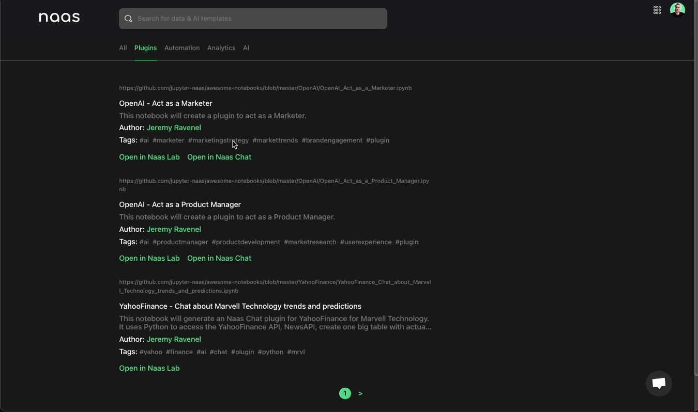
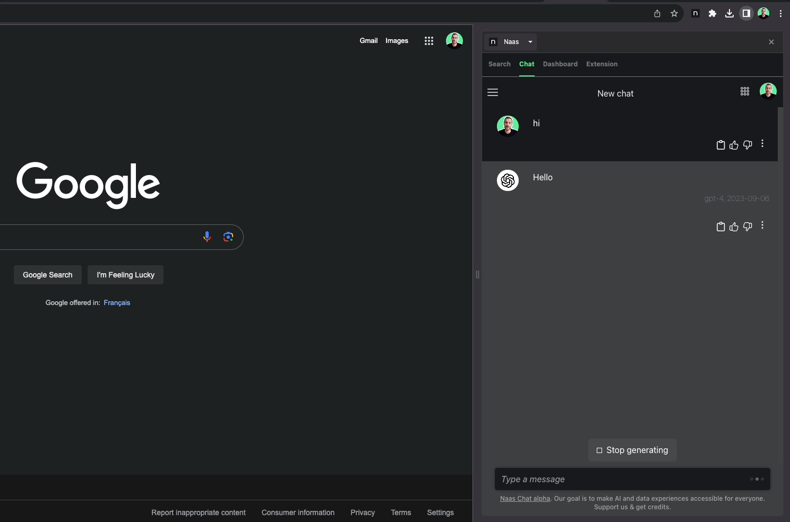

# Basic Usage
---

If you're just getting started, this guide will walk you through the basic usage of our platform. Naas is designed to be user-friendly and intuitive, allowing you to leverage powerful AI models and data tools with ease. It’s our “no-code” experience.

## Accessing Language Models

On the side bar of the Chat interface, you'll find a list of various language models. If you don’t want to use template, you can leverage raw models by simply starting a “New Chat”. Each model has its own unique capabilities and applications, allowing you to choose the best one for your specific task or need. Simply select the appropriate model from the list to start using it.

## Starring Chats

As you interact with Naas, you may find certain conversations or interactions to be particularly important or useful. Naas allows you to "star" ⭐️ these conversations, marking them for easy future reference. This feature ensures that your most important interactions are always just a click away.

## Installing Chrome Extension

For an even more integrated experience, consider installing the Naas Chrome extension. This feature allows you to have the Naas Chat always available on your screen, providing a split-screen view where you can conduct research, summarize articles, structure notes, write code snippets, and ideate, all while interacting with the Naas Chat.

[→ Install Chrome Extension](https://chrome.google.com/webstore/detail/naas-ai-assistant-for-ana/cpkgfedlkfiknjpkmhcglmjiefnechpp/reviews)
## Understanding Prompts

Naas has a variety of prompts templates available in the Search for different personas or business use cases. These prompts cater to various professional personas such as a CEO, marketer (see the list in search results). When you select a template, you have two options:

- "Open in Naas Chat" if you want to use the template directly in chat.
- “Open it in Naas Lab” if you want to configure the template.

When you choose to open in Naas Chat, the plugin is loaded and the conversational assistant is created. This allows for easy interaction with a pre-built prompt.

## Slash Command (coming soon)

We're developing a new feature that will allow you to trigger custom actions from your Chat. This will empower data consumers to perform tasks independently, while data product developers can focus on building awesome data product experiences.

## Billing and Account Balance

It's important to keep track of your usage and costs while using Naas. Every API call you make is recorded in real-time and affects your credit balance. You can monitor these costs in the Billing section of the Naas platform, providing a clear and straightforward view of your usage.

## Conclusion

The basic usage of Naas is designed to provide a simple and intuitive introduction to the platform. By understanding and utilizing these features, you can start to optimize your workflow and benefit from what Naas has to offer.
