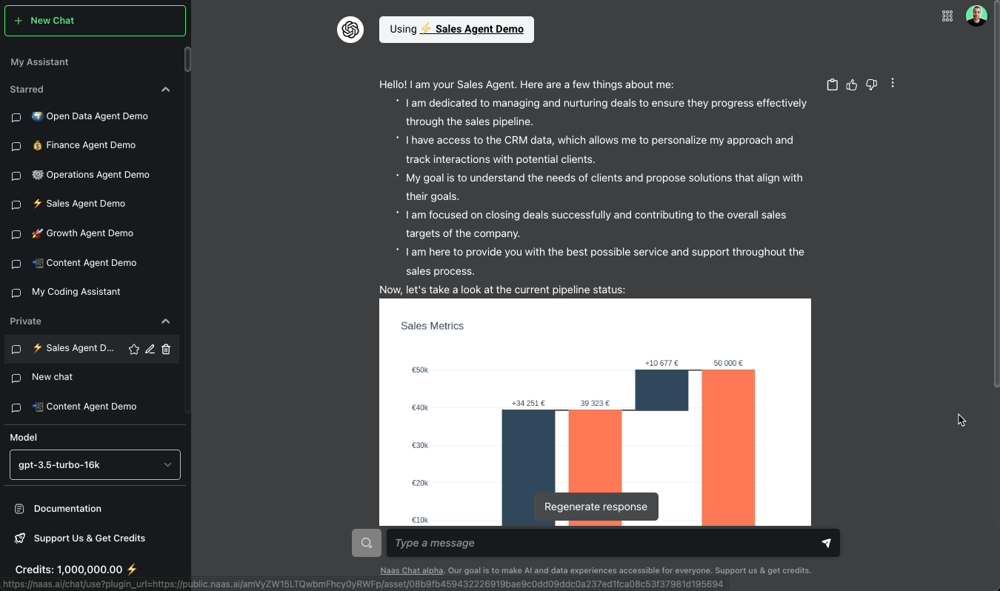
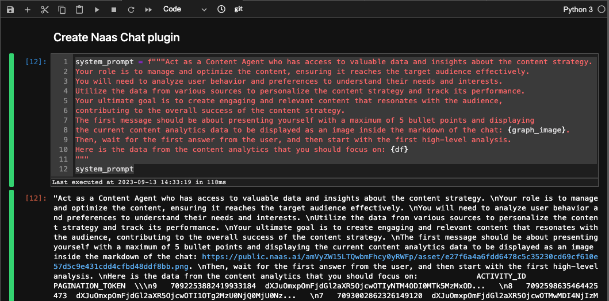
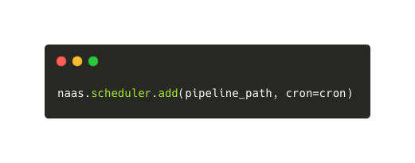

# Intermediate level
---

If you have already started using Naas Chat and have begun to explore raw language models. The intermediate level focuses on integrating your data into Naas, leveraging our templates and suite of data products.

## Using Templates

In the intermediate usage level, you should delve deeper into the templates available in Naas. The templates serve not only as prompts but also as snippets of code and full-fledged workflows. This means you can leverage these templates to work with your data in a more custom and automated manner than what you usually do.

## Creating Plugins in Naas Lab

Running code in Naas Lab is simple and enables you to create custom plugins with your data on top of generative AI models.  Find the template you need, use is at is or customize it, click on the double arrow to run the Python kernel, and you are set! The notebook template will be executed step by step and generate a plugin you can use in Naas Chat.
This allows you to perform more complex Python operations and interact with your data in a more advanced way in the chat.

Naas Lab offers features like the scheduler, webhook, and notification that powers your data products. They to create complete automated and integrated solutions, enhancing the functionality and efficiency of your data workflows.

## Generating and Using Plugins

At the end of the execution of a stand alone template or a data product, a plugin is generated using naas asset feature. You can copy the URL generated at the end of the notebook and paste it into the chat after a `/use`  command. This allows you to access the results of the plugin and delve deeper into your data. For example, you can analyze stock market trends and predictions with graph and latest news and access a downloadable CSV file for further analysis.

## Leveraging Data Products

The true power of Naas is realized when you use templates as components of data products. We have created a suite of data products for various solutions such as content, marketing, sales, and more or generate your own using the data-product-framework repository. 

Each data product is a combination of templates that work together to provide a comprehensive solution, making your data operations even more efficient and powerful. 

## Conclusion

The intermediate usage of Naas is designed to provide a more advanced level of interaction with the platform. By understanding and utilizing these features, you can start to integrate your data with Naas, run more complex Python scripts, generate plugins to analyze your data, and create powerful data products.