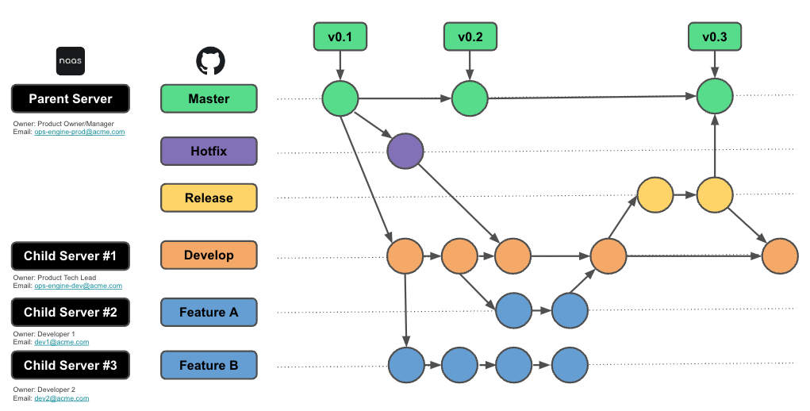

# Collaboration & Versioning

Following software engineering best practices to create sustainable data products

## Context

Data products development needs collaborative efforts to manage the data product development cycles effectively. The deep intergation with what GitHub offers in terms of advanced version control and collaboration features enabeg teams to collaborate seamlessly and maintain a clear, organized work history.

## Benefits

### **Team Collaboration**

Foster a collaborative environment by enabling team members to collaborate on data products, notebooks, and other resources. Share assets, provide feedback, and communicate effectively within the platform to ensure everyone stays aligned and informed.

### **Version Control**

Maintain a clear and organized history of your data products and other assets with built-in version control features. Track changes over time, revert to previous versions when needed, and ensure that your team always has access to the most up-to-date resources.

### **Conflict Resolution**

Prevent and resolve conflicts arising during collaborative development with the platform’s advanced conflict resolution tools. Identify and address potential issues before they become roadblocks, ensuring a smooth and efficient development process.

### **Permission Management**

Control access to your data products, notebooks, and other resources with granular permission settings. Assign roles and configure permissions to ensure that team members have the right level of access to the tools and resources they need.

### **Traceability and Accountability**

Maintain clear visibility into the contributions and actions of each team member, fostering accountability and ensuring that everyone stays on track and focused on their goals.

# Features

### Asset Sharing: Collaborative Notebooks

The Collaboration and Versioning module allows users to easily share notebooks as assets. This feature enables seamless collaboration, as team members can access, review, and contribute to notebooks in real-time. By sharing notebooks, teams can collaborate more effectively, leveraging collective knowledge and expertise to drive innovation and productivity.

### Git Extension Integration

The module integrates with Git, a popular version control system, within the lab environment. This integration enables teams to leverage Git's powerful features for managing code versions, branches, and merging. By utilizing Git within the lab, teams can effectively track changes, revert to previous versions, and ensure that their data products are always up-to-date and in sync.

### Chat: Real-time Feedback Loop

The Collaboration and Versioning module includes a chat feature that facilitates real-time communication and feedback among team members. This chat functionality creates a seamless feedback loop, allowing for quick discussions, sharing of ideas, and resolving issues. By enabling real-time collaboration, teams can iterate faster, make informed decisions, and maintain a high level of productivity.

### GitHub

# Conclusion

By incorporating the Collaboration and Versioning module, businesses and development teams can work together more effectively, reduce duplication of effort, and maintain a clear and organized work history. This powerful offering enables teams to collaborate seamlessly, manage their data product development process efficiently, and ultimately deliver more value to their organization.