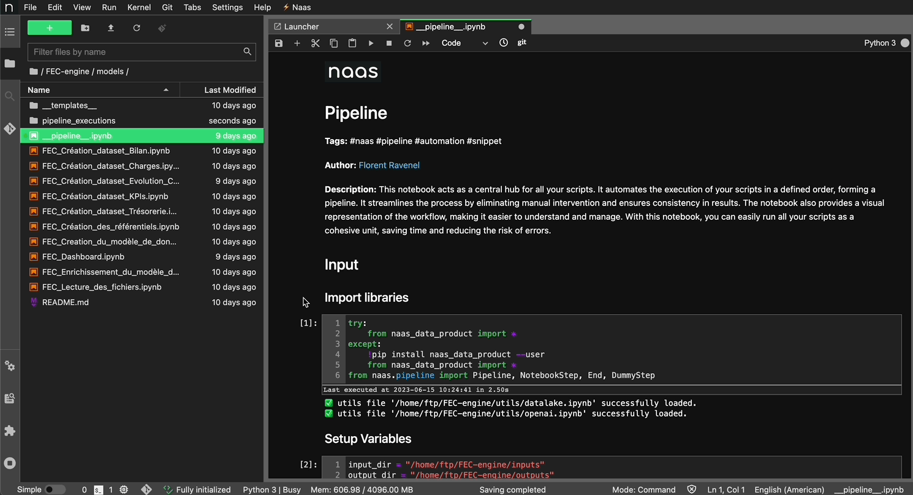

# Lab
---

The place to create and run your Data Products

## Context

The Development Lab is an integral part of the Naas account, designed as a comprehensive tool for developers and data enthusiasts. This environment is specifically tailored for individuals looking to develop their own data analysis, plugins, data products, and APIs using Python and notebooks. The interface is based on JupyterLab, the most reputable open-source tool for data science, providing a robust and efficient platform for data-related tasks.

## Benefits

### Secured Private Server

The Development Lab is a private server dedicated to you and hosted in our virtual private cloud. There's no need for any installations, as you can access the Development Lab from any device with an internet connection. This ensures that your data remains secure, while also providing the convenience of remote accessibility.

### Managed JupyterLab

The Development Lab is our managed version of JupyterLab, the most popular development environment for data science and machine learning. It provides a familiar interface for any data professional who has previously worked with Python and Notebooks.

### Access to Popular Data Science Libraries

The Lab gives you direct access to various popular data science libraries and tools such as Pandas, NumPy, and more. This ensures that you are always up-to-date with the latest advancements in the data science field and have the best tools at your disposal for building your data products.

### Customizable Workspace

The Lab is highly customizable. You can configure the interface and install additional packages or extensions, and even manage your workspace theme. This allows you to create a workspace that perfectly aligns with your individual requirements and workflow.

### Collaboration and Knowledge Sharing

By sharing code, insights, and best practices, your team can stay aligned, efficient, and productive. The integrated version control system ensures that your code is always up-to-date and organized. It allows efficient collaboration to happen on code development, tracking changes, and maintaining a history of your project's progress.

### Learning Resources

The Development Lab provides access to many tutorials and constantly updated templates. These resources enable you to enhance your skills and work more efficiently without going to different places.

### Integration with Naas Platform Features

The Development Lab is designed to seamlessly integrate with other Naas features such as AI-Powered Chat Interface, Workflow Automation, Analytics and Dashboard Deployment, or the Chrome Extension. This integration allows you to create sophisticated data products that leverage the full capabilities of the platform.

## Features

### Dockerized Instance

Your Lab access is attached to a private server running with docker and giving you access to different resources based on your chosen plan, the lab plan provides different resources on RAM, vCPU, and storage memory. This efficient resource management ensures that you have the necessary resources to execute your projects smoothly.

### Multi-Medium Handling

Create and manage various medium types, including Python notebooks, consoles for Python, terminals, text files, CSVs, HTML files, and PNG files. This versatility ensures that you have all the tools you need for your data science projects in one place.

### Navigation bar

On top of what JupyerLab provides by default, we added a 'Naas' tab that gives you access to different features that Naas adds on top of Jupyter such as the lab manager, search, and chart. You can also access the documentation, the GitHub from here.

### Sidebar

1. **Notebook outline:** Access to the outline of your notebook like in a word document 
2. **File System**: By default, you can access a file system that allows you to store up to 20GB of data. However, this is not intended for data storage; it's primarily for storing your files that will compute and execute your data.
3. **Search**: This feature enables you to search different documents across your lab.
4. **Git versioning:** This allows you to clone any repository and push/pull without and save it into your file system.

### Central panel

The central panel enables you to open different tabs (notebooks, files, html files) like in a browser, and drag and drop them to arrange your screen, you can split in 2, 3, 4 different screens right inside the central panel. 

### Action bar in Notebook

1. **Run Notebook**: This feature allows you to execute the current notebook.
2. **Save**: You can save your current work at any time.
3. **Add New Cells**: This feature allows you to add new cells to your notebook for further data analysis or coding.
4. **Refresh**: You can refresh your notebook at any point.
5. **Run All Cells**: This feature allows you to execute all cells in the notebook at once, saving you the time of running each cell individually.
6. **Change Cell Type**: You can change the type of cells to raw, markdown, or code, depending on your needs.
7. **Version Control**: The notebook also offers version control capabilities with direct git diff analysis. This allows you to track and control changes to your projects, enhancing collaboration and reducing errors.
8. **Kernel Control:** Whether you are working with the pre-installed Python kernel or a custom one that you have installed, you can easily switch between them to suit your project's needs.

### Pre-installed Libraries

You can access many pre-installed data science libraries.

### Templates

On your file system, you have access to a list of components that you can use to create your data products: the awesome-notebooks templates. These templates are constantly updated.

### Jobs Execution

You can execute your pipeline on schedule using the workflow automation feature (see Workflow Automation section).

## Conclusion

In summary, the Development Lab is a powerful and versatile development environment that provides various tools and features to enhance your data projects. With its secured server container, robust features, extensive libraries, and customization options, it can help enthusiasts and developers create, manage, and execute their projects.