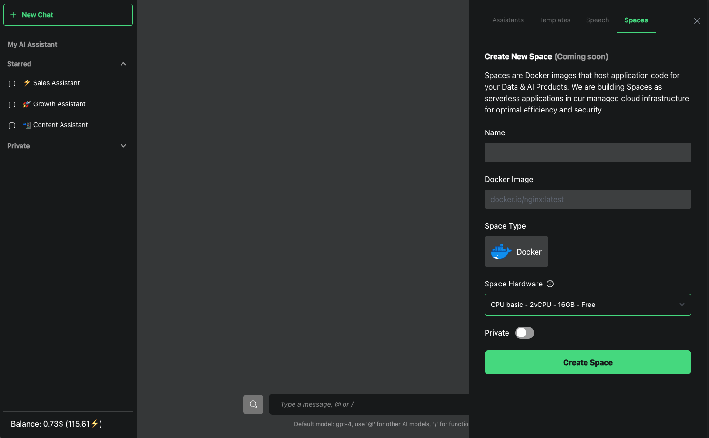

# Serverless Deployment
---

:::tip

We're in the early alpha stage, this page is constantly evolving, contact support@naas.ai to learn more.

:::

## Context

A service that enables Naas users to deploy data products and services in dedicated containers within the Naas cloud infrastructure. This specification outlines the technical details and requirements of the Naas Space service.

## Benefits

### **Simplified Deployment**

Naas Space automates the deployment process, making it easy for users to launch their data products and services.  The low-code formula interface provided by Naas Space simplifies the deployment process, making it user-friendly even for those with minimal technical knowledge. Users can focus on their data and insights while Naas Space handles the deployment.

### **Dedicated Resources**

The service supports a wide variety of data products and services, providing users with the flexibility to deploy dashboards, static websites, APIs, models, and more in dedicated containers. You can request the CPU and memory you need.

### **Optimized Resource Allocation**

Space resource management capabilities enable you to allocate computing resources efficiently and effectively. This ensures that your data processing tasks have the necessary resources to run smoothly, while also optimizing your overall infrastructure costs.

### **Customized Access Control**

With the ability to define their own domain or create a specified subdomain, users can control who has access to their data products, ensuring secure sharing.

### **Seamless Integration**

Integrate Scalable Computing with other modules of the Naas v2 platform, such as the Searchable Data Catalog and Template Library, Analytics and Dashboard Deployment, and AI-powered Chat Interface. This seamless integration allows you to create powerful and sophisticated data products that drive value for your business.

### **Scalability and Flexibility**

You can easily scale your data processing tasks to meet the growing demands of your organization. Whether you’re dealing with larger datasets, more complex models, or increased user traffic, the platform’s scalable infrastructure ensures consistent performance and a smooth user experience.

## Features

### **Hosting/Domain Registry**

All users can access the Naas Space feature under the same namespace: [my-data-product].**[space.naas.ai](http://space.naas.ai/)**. If a user is in Enterprise mode, they can define their own domain, such as [dashboard].client.com, or create a specified subdomain [dashboard].[client].space.naas.ai to be isolated. The advantage of using Enterprise mode is to have a secure namespace and be able to name data products as desired.

### Multi **Data Products Support**

The Naas Space service supports various data products and services, including:

- Dashboards (first iteration focus on Plotly)
- Docker containers
- Static websites
- APIs
- Models
- Alerting systems

### Low-code deployment functions

The Naas Space service provides a generic way to handle the deployment of data products and services using Knative. On top of this API, different low-code formulas can be created based on the nature of the data products. These low-code formulas provide an easy-to-use interface for users to deploy their data products.

### **Authentication**

Naas Space supports basic authentication. Advanced authentication using OAuth2 providers can implemented for Enterprise users to share data products more securely.

### Custom Environment Variables and Domains

Naas Space supports custom environment variables, allowing users to tailor their workspace settings efficiently. Additionally, enterprise users can enhance their branding and security with custom domains, creating a personalized, isolated space for their data products.

## **Conclusion**

Naas Space provides a simple and efficient way for Naas users to deploy their data products and services. The service supports various data products and services, including dashboards, static websites, APIs, models, and alerting systems. Naas Space automate the deployment process and provide an easy-to-use interface for users to deploy their data products.