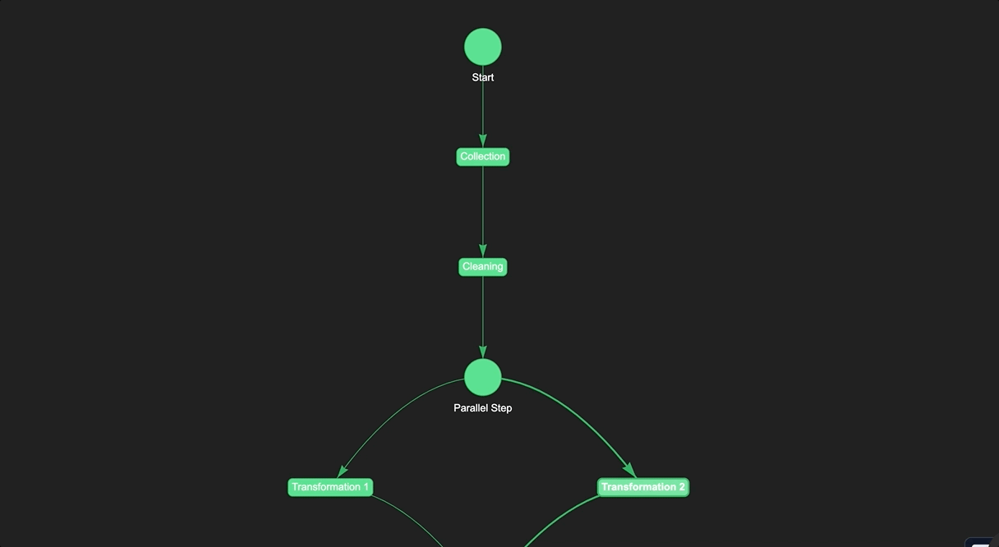

# Workflow Automation
---

Automate Any Data Jobs With Naas 

## Context
Streamlining your data product development process is crucial to keep pace with the rapid advancements in Data & AI. In other words, your data products need to evolve, fast. Our low-code approach to wokflow automation enables that and eases the design, administration, and implementation of simple and complex data workflows or pipelines. It empowers businesses and development teams to concentrate on value delivery and growth stimulation.

If you are a data professional, you might be working with several different tools for data ingestion, orchestration, and other data platform functions. Naas offers a different paradigm where you combine notebook templates to create automated workflows that become features of your data products.

## Benefits

### Intuitive Workflow Creation

Design and build data workflows easily using intuitive low-code functions and an extensive library of pre-built notebook templates. Create workflows that automate data ingestion, transformation, analysis, and visualization, significantly reducing the time and effort required to develop and deploy data products.

### Flexible Scheduling and Triggers

Schedule your workflows to run at specific intervals or trigger them based on specific events, ensuring that your data products are always up-to-date and relevant. Take advantage of a wide range of scheduling options, from simple recurring schedules to more advanced cron expressions, to cater to your unique business requirements.

### Error Handling and Monitoring

Monitor the performance of your workflows and quickly identify and resolve any issues that may arise. The platform provides robust error handling and monitoring features, including real-time notifications, logging, and retries, ensuring that your workflows remain stable and reliable.

### Scalable Workflow Execution

Execute your workflows on a scalable infrastructure that adapts to your growing data and user demands. The platform scales to accommodate increased data volume, user traffic, and workflow complexity, ensuring a consistent user experience and optimal performance.

### Collaboration and Version Control

Collaborate with your team members on the development and management of your workflows, leveraging the platform’s version control and access management features to ensure that your workflows are always up-to-date and accessible to the right people.

### Integration with Naas Platform Features

Seamlessly integrate the Workflow Automation feature with other Naas features, such as the AI-Powered Chat Interface, Searchable Data Catalog and Template Library, and Analytics and Dashboard Deployment or Chrome Extension. This integration enables you to create powerful and sophisticated data products that leverage the full capabilities of the platform.

## Features

### Scheduler

The scheduler is a key feature of Workflow Automation. It allows you to run notebooks on a schedule using the cron syntax, forming a crucial part of the automation workflow.

### Webhook

Webhooks are external triggers that can come from any application. For example, a button in your application could trigger a notebook inside the Development Lab when clicked.

### Pipeline

For more complex workflows requiring the combination of different templates, you can use the pipeline feature. This feature has been developed with the Airflow syntax in mind, allowing you to start designing your workflow with dummy notebook steps.

### Notifications

You can send error notifications if there is a problem. You can also send notifications to inform users about the execution status or even provide data output.

### Job and Event Tracking

You can track all active jobs and execute events through the Naas Lab Manager. Each job or event in the manager is associated with detailed information such as the start time, end time, execution duration, and the status of the job. This allows you to identify any delays or bottlenecks in your workflows and take corrective action promptly.

### Dockerized Instance

Your Lab access is attached to a private server running with docker and giving you access to different resources based on your chosen plan, the lab plan provides different resources on RAM, vCPU, and storage memory. This efficient resource management ensures that you have the necessary resources to execute your projects smoothly.

### Conclusion

By incorporating the Workflow Automation module, businesses and development teams can significantly accelerate the data product development process, simplifying the creation, management, and deployment of complex data workflows. This module empowers users to design and build data workflows with ease, ensuring that their data products are always up-to-date, relevant, and delivering value to their organization.